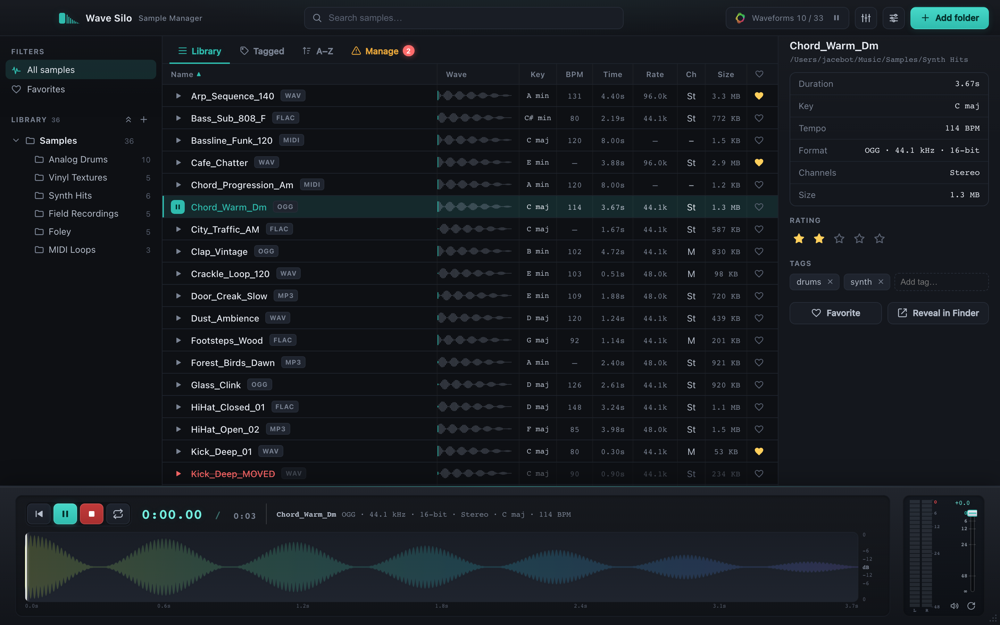

<div align="center">


# Wave Silo

### Your samples, finally organized.

A fast, **offline** sample library manager — waveform preview, real **BPM &amp; key** analysis,
and **drag straight into your DAW**. Own‑your‑data, no account, no subscription.

<p>
<a href="https://wavesilo.com"></a>
<a href="https://github.com/jacebot/wavesilo/releases/latest"></a>

</p>



</div>

## Download

Free, all three platforms — grab it at **[wavesilo.com](https://wavesilo.com)** or the
**[latest release](https://github.com/jacebot/wavesilo/releases/latest)**.

| Platform | File |
|---|---|
| 🍎 macOS (Apple Silicon) | `Wave.Silo-<v>-arm64.dmg` |
| 🍎 macOS (Intel) | `Wave.Silo-<v>.dmg` |
| 🪟 Windows | `Wave.Silo.Setup-<v>.exe` |
| 🐧 Linux (Debian/Ubuntu) | `Wave.Silo-<v>.deb` |
| 🐧 Linux (other) | `Wave.Silo-<v>.tar.gz` |

> Unsigned for now — on macOS right‑click → **Open**; on Windows choose **More info → Run anyway**.

## What it does

- 🎛️ **Drag into your DAW** — audition a sample, then drag it onto a track in Ableton, Logic, FL. Drag folders in to add them.
- 🎚️ **Real BPM &amp; key** — actually analyzes the audio (not filename guessing), plus waveform and metadata.
- 🗂️ **Own your data** — a local SQLite library. No account, no cloud, fully offline.
- 🎹 **Every format, even MIDI** — WAV · AIFF · MP3 · FLAC · OGG, plus MIDI with a built‑in synth &amp; piano‑roll.
- 🔎 **Find sounds fast** — fuzzy search, folder tree, tags, favorites, smart Type groups, and an A–Z quick‑jump.
- 📈 **A real audio engine** — play/seek waveforms, live frequency spectrum, true peak metering.

## About this repo

This is the **marketing site** for Wave Silo — [Vite](https://vitejs.dev) + React, deployed to
[wavesilo.com](https://wavesilo.com) via Vercel. The desktop app is built with Electron + TypeScript.

```bash
npm install
npm run dev      # local dev
npm run build    # production build → dist/
```
